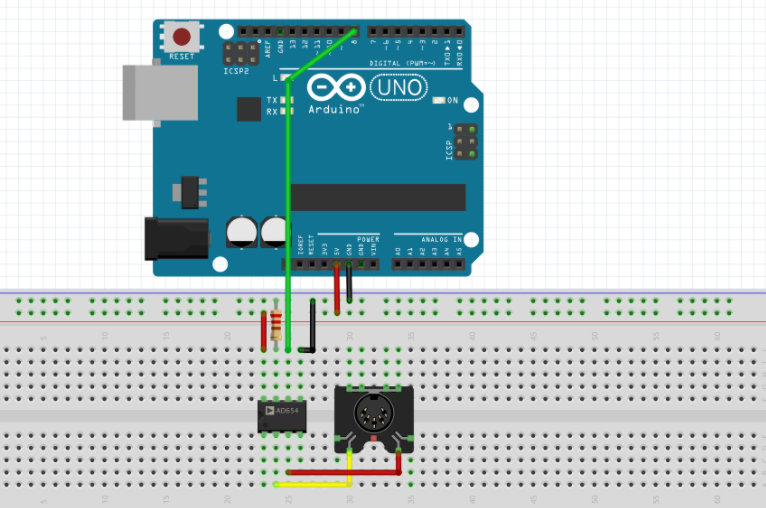
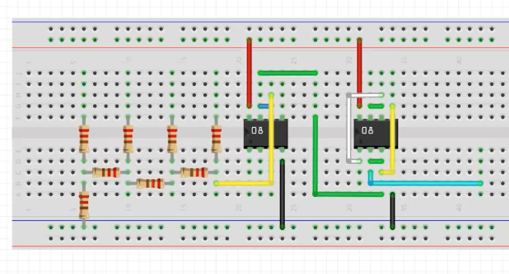

# Arduino Synth

This project demonstrates how to create a synthesizer using an Arduino and a DAC.

### Prerequisites

You'll need these softwares to run this project.

-   Arduino IDE

### Schematic

**MIDI**

Build the following circuit

**Synthesizer**

Build the following circuit

Where the resistor ladder is built using 10K resistors as the vertical resistors and 20K resistors as the horizontal resistors. The red wires connect to 5V and the black connect to GND. The cyan wire is the circuit output.

Each of the resistors should be connected to an Arduino port. For example, the first resistor connects to 0, the second connects to 1, etc.

### Running

**MIDI**

Upload the sketch under `midi/` to the Arduino.

**Synthesizer**

Upload the sketch under `synth/` to the Arduino.

### License

MIT License

Copyright (c) 2020 Devin Mui

Permission is hereby granted, free of charge, to any person obtaining a copy of this software and associated documentation files (the "Software"), to deal in the Software without restriction, including without limitation the rights to use, copy, modify, merge, publish, distribute, sublicense, and/or sell copies of the Software, and to permit persons to whom the Software is furnished to do so, subject to the following conditions:

The above copyright notice and this permission notice shall be included in all copies or substantial portions of the Software.

THE SOFTWARE IS PROVIDED "AS IS", WITHOUT WARRANTY OF ANY KIND, EXPRESS OR IMPLIED, INCLUDING BUT NOT LIMITED TO THE WARRANTIES OF MERCHANTABILITY, FITNESS FOR A PARTICULAR PURPOSE AND NONINFRINGEMENT. IN NO EVENT SHALL THE AUTHORS OR COPYRIGHT HOLDERS BE LIABLE FOR ANY CLAIM, DAMAGES OR OTHER LIABILITY, WHETHER IN AN ACTION OF CONTRACT, TORT OR OTHERWISE, ARISING FROM, OUT OF OR IN CONNECTION WITH THE SOFTWARE OR THE USE OR OTHER DEALINGS IN THE SOFTWARE.
